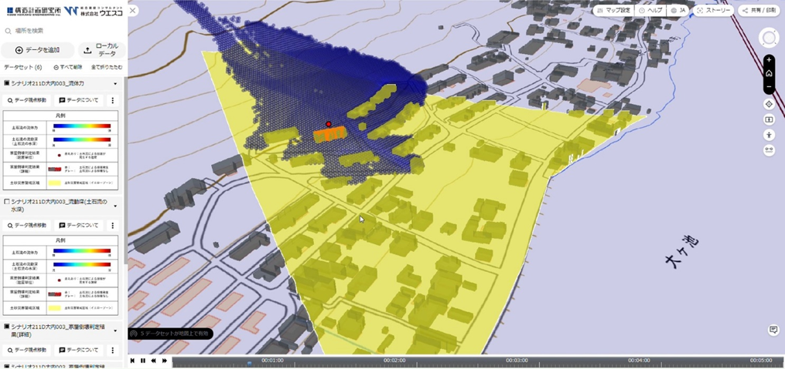

# 家屋倒壊判定モジュール <!-- OSSの対象物の名称を記載ください。分かりやすさを重視し、できるだけ日本語で命名ください。英語名称の場合は日本語説明を（）書きで併記ください。 -->

<!-- 先生に説明していたような技術レポート(pdf)をREADMEにいれる -->


<!-- OSSの対象物のスクリーンショット（画面表示がない場合にはイメージ画像）を貼り付けください -->


## 1. 概要 <!-- 本リポジトリでOSS化しているソフトウェア・ライブラリについて1文で説明を記載ください -->
本リポジトリでは、Project PLATEAUの令和4年度のユースケース開発業務の一部である
UC23-02「精緻な土砂災害シミュレーション」に関する成果物である「家屋倒壊判定モジュール」のソースコードを公開しています。

「精緻な土砂災害シミュレーション」により、PLATEAUの3D都市モデルから得られる建物の形状や配置、さらに、
構造種別等の属性情報を考慮した精度の高い土石流シミュレーションが実施可能となります。

## 2. 「精緻な土砂災害シミュレーション」について <!-- 「」内にユースケース名称を記載ください。本文は以下のサンプルを参考に記載ください。URLはアクセンチュアにて設定しますので、サンプルそのままでOKです。 -->
現在運用されている土砂災害警戒区域・土砂災害特別警戒区域（以下「土砂災害警戒区域等」とする）のハザード情報は、
地形から力学的に推定される最大範囲を網羅するものとなっていますが、
地域によっては居住エリアの大半が土砂災害警戒区域等に指定されており、実質的には避難場所の選定が困難な状況が発生しています。
また、一般的には土石流に起因する土砂災害警戒区域等は地形条件から定められていますが、土石流等が家屋に衝突し、
家屋を流出・倒壊とさせたことによって生じたエネルギー変化や流動方向に対する変化の影響が評価されておらず、
実態に即した土石流の氾濫範囲となっていません。

「精緻な土砂災害シミュレーション」では、行政の避難所選定支援や避難計画の高度化を目指して以下の2つのシステムを構築しました。

* 3D都市モデルを活用した精緻な土石流シミュレータ
* シミュレーション結果から土砂災害警戒区域等のエリア内のリスク分布を三次元表現する可視化システム

本システムの詳細については[技術検証レポート](https://xxxx)を参照してください。

## 3. 利用手順 <!-- 下記の通り、GitHub Pagesへリンクを記載ください。URLはアクセンチュアにて設定しますので、サンプルそのままでOKです。 -->

本システムの構築手順及び利用手順については[利用チュートリアル](https://r5-plateau-acn.github.io/Building-collapse-detector/)を参照してください。

## 4. システム概要 <!-- OSS化対象のシステムが有する機能を記載ください。 -->

* 「家屋倒壊判定モジュール」は、家屋の属性情報(構造種別等)を考慮して倒壊判定閾値を変動させる機能を持ったFortranサブルーチンです。
* Morpho2DHのオブジェクトファイル群と一緒にビルドすることにより、家屋倒壊判定アルゴリズムをカスタマイズしたMorpho2DHの実行バイナリ(ソルバーのexe)を作成できます。
* 倒壊判定アルゴリズムの詳細に関しては、[家屋倒壊判定に関する技術資料](tech_report.pdf)をご覧ください。

## 5. 利用技術

ソルバーの実行バイナリのビルドに以下のFortranコンパイラが必要です。

| 種別    | 名称                                                                                                    | バージョン   | 内容           |
|-------|-------------------------------------------------------------------------------------------------------|---------|--------------|  
| コンパイラ | [Intel oneAPI](https://www.intel.com/content/www/us/en/developer/tools/oneapi/toolkits.html#base-kit) | Intel(R) 64, Version 2021.10.0 Build 20230609_000000    | Fortranコンパイラ |
|  | [Microsoft Visual Studio 2019](https://visualstudio.microsoft.com/ja/)                                                                      | 16.11.8 | C,C++コンパイラ  |

## 6. 動作環境 <!-- 動作環境についての仕様を記載ください。 -->

| 項目     | 最小動作環境                        | 推奨動作環境          | 
|--------|-------------------------------|-----------------| 
| OS     | Microsoft Windows 10/11 64bit | 同左              | 
| CPU    | Intel Core i5以上               | Intel Core i7以上 | 
| メモリ    | 4GB以上                         | 16GB以上          | 
| HDD    | 5GB以上の空き容量                    | 50GB以上          | 
| ネットワーク | 高速インターネット環境                   |                 | 

## 7. 本リポジトリのフォルダ構成 <!-- 本GitHub上のソースファイルの構成を記載ください。 -->

本リポジトリのフォルダ構成は、以下のようになっております。
`morpho2DHSolver`フォルダ内に、倒壊判定モジュール組み込み版Morpho2DHのソルバーのソースやオブジェクトファイルが含まれています。
ソルバーの利用方法やビルド方法は[利用チュートリアル](https://r5-plateau-acn.github.io/Building-collapse-detector/)をご覧ください。

```text
[リポジトリルート]
  - morpho2DHSolver : 倒壊判定モジュール組み込み版Morpho2DHのソルバーのソースやオブジェクトファイル
      - iRICsolvers_Morpho2DH : ビルド済みのMorpho2DHのソルバー(morpho2d.exe)が保存されるフォルダ
        - definition.xml : exeのバージョン等が記載されているxml
        - morpho2d.exe : ビルド済みのMorpho2DHのソルバーのexe
        - translation_ja_JP.ts : 翻訳ファイル
      - src : Morpho2DHのソルバーのソース・オブジェクトファイルを収めているフォルダ
        - build.bat : ビルドを実行するバッチファイル
        - func_cforce.f90 : 家屋倒壊閾値を変動させるサブルーチン
        - func_fbuilding.f90 : 土石流外力を計算するサブルーチン
        - *.obj : 建屋倒壊判定以外のソルバーのビルド済みファイル
        - *.mod : 建屋倒壊判定以外のソルバーのビルド済みファイル
        - *.lib : 建屋倒壊判定以外のソルバーのビルド済みファイル
  - tech_report.pdf : 倒壊判定ロジックに関する技術資料
```

## 8. ライセンス <!-- 変更せず、そのまま使うこと。 -->

- ソースコード及び関連ドキュメントの著作権は国土交通省に帰属します。
- 本ドキュメントは[Project PLATEAUのサイトポリシー](https://www.mlit.go.jp/plateau/site-policy/)（CCBY4.0及び政府標準利用規約2.0）に従い提供されています。

## 9. 注意事項 <!-- 変更せず、そのまま使うこと。 -->

- 本リポジトリは参考資料として提供しているものです。動作保証は行っていません。
- 本リポジトリについては予告なく変更又は削除をする可能性があります。
- 本リポジトリの利用により生じた損失及び損害等について、国土交通省はいかなる責任も負わないものとします。

## 10. 参考資料 <!-- 技術検証レポートのURLはアクセンチュアにて記載します。 -->

- 技術検証レポート: https://xxxx
- PLATEAU WebサイトのUse caseページ「精緻な土砂災害シミュレーション」: https://www.mlit.go.jp/plateau/use-case/uc23-02/
- iRIC Morpho2DH: https://i-ric.org/solvers/morpho2dh/
